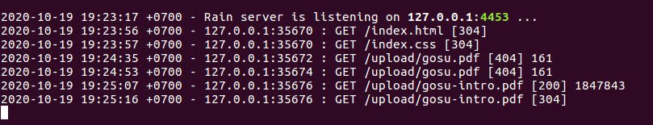

# Rain
A Simple HTTP Server
 
simple web server, beginner,
static web server, cara kerjanya adalah: 
ada direktori "root-public-document", didalamnya terdapat se
mua resource yang mungkin klien me request nya, jika yang di
request client adalah file other than .html extension file,
maka file nya diberikan tanpa ada modifikasi, bila yang dimi
nta adalah file berekstensikan .html, maka ada prosedur tamb
ahan, yaitu ada modifikasi, seperti isinya di read dan di ma
sukkan ke skeleton/template.

cara menjalankanya adalah:
Rain::HTTPServer.run()

server ini punya banyak drawback, seperti:
- keamanan yang parah
- pengecekan user input, yaitu di HTTP requestnya
- fitur yang sedikit di implementasi HTTP nya
- dan lain lain
 
# Screenshot
 
 
 
Woow, isnt that awesome!
